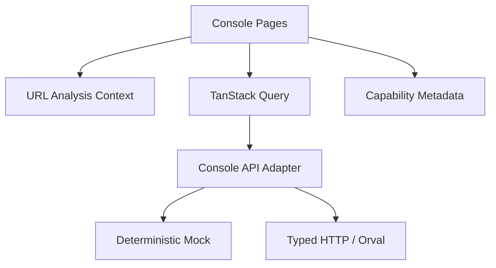

# Architecture

## 边界

产品是单一内部前端，不引入微前端、租户、RBAC/ABAC、任意 SQL、Widget Runtime 或通用管理平台能力。

## 分层

1. `pages/`：P0 页面、扩展只读详情、分析工作区与会话级工具。
2. `components/`：页面共享的 Section、状态、来源标签与图表选项，不建设独立 Design System。
3. `hooks/useAnalysisContext.ts`：URL 驱动的 Candidate/Baseline/Dataset/Profile/Run/Track/Risk/Period 上下文。
4. `api/consoleApi.ts`：Mock、HTTP、Hybrid Adapter 边界。
5. `api/capability-map.ts`：接口能力、来源与可用性元数据。
6. `mocks/`：从任务包 JSON 归一化或显式确定性派生的 demo contract；`extendedData.ts` 提供 collection、资源与生命周期场景。

## 路由

- `/overview`
- `/runs`、`/runs/:runId`
- `/compare/:comparisonId`
- `/cases`、`/cases/:caseId`
- `/evaluations`、`/evaluations/:evaluationId`
- `/evidence-bundles`、`/evidence-bundles/:bundleId`
- `/analytics`、`/reports`、`/alerts`、`/settings`
- `/candidates/:candidateId`、`/baselines/:baselineId`
- `/datasets/:datasetVersion`、`/profiles/:profileVersionId`

Reports 与 Alerts 的客户端变更只存在于当前 React 会话，刷新即丢失；Settings 偏好只写入设备 `localStorage`。三者都显示明确边界说明，不把本地状态描述为后端能力。

## 快照语义

Overview 目标合同是 `GET /v1/dashboard/overview` 的单水位响应。每个模块共享 `snapshotId`、`watermark` 与 `projectionLagMs`；STALE 保留旧快照并醒目标记，ERROR 不把缓存伪装为实时，INVALID 不显示正式 Quality Score。

## 响应式

- 1920×1080：12 列四段固定高度，设计总高小于视口。
- 1600×900：压缩标题、卡片和行高，仍保持单屏结构。
- 1440×900：折叠侧栏、8 列重排、允许纵向滚动但禁止页面横向溢出。
