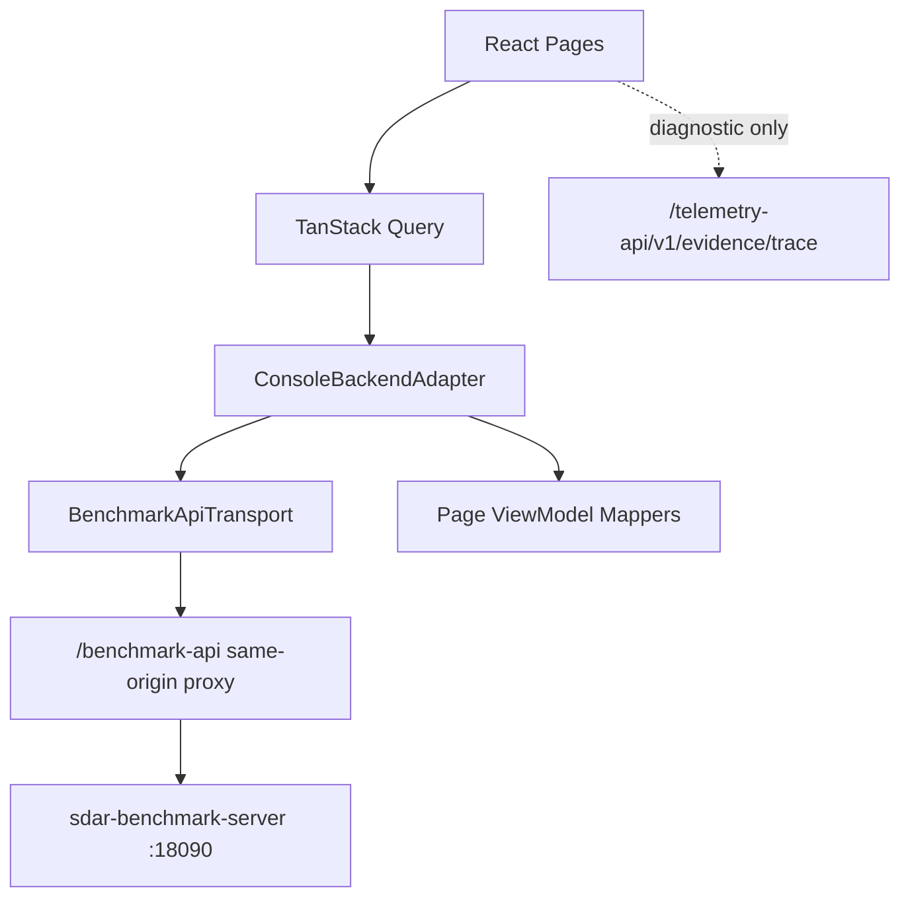

# Architecture

Console 是内部只读/轻命令前端：PostgreSQL 保持 Run/Snapshot/Evaluation authority；ClickHouse 仅是 Evidence/Analytics projection；ArtifactStore 保存不可变 Bundle 和 EvaluationInputSnapshot body。

主要下钻：Overview → Run/Case/Comparison → Evaluation typed tabs → Evaluation Input Snapshot → Domain/Provider immutable material → Evidence Bundle records/timeline/graph/diff。

内网 v0.1 不包含登录、Token、Cookie Session、RBAC、OIDC、TLS、CSRF、Rate Limit 或 IP allowlist。Reports 与 Attention 在 HTTP 模式使用后端持久化；仅 Mock 模式保留会话级行为。
